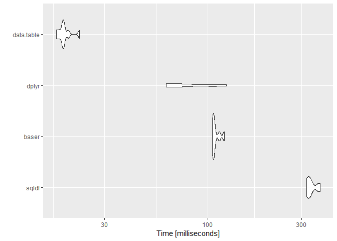
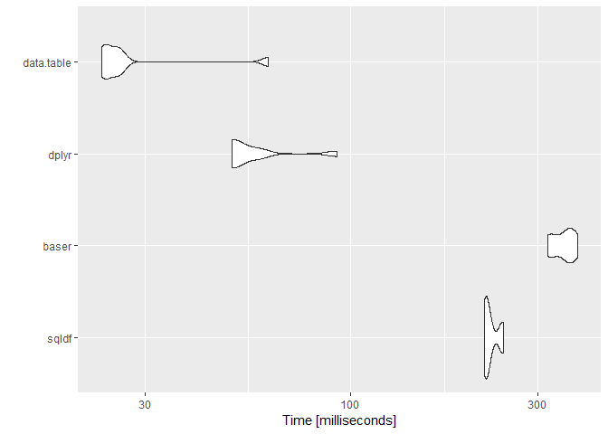
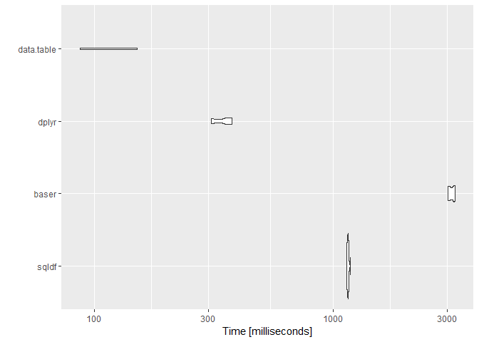
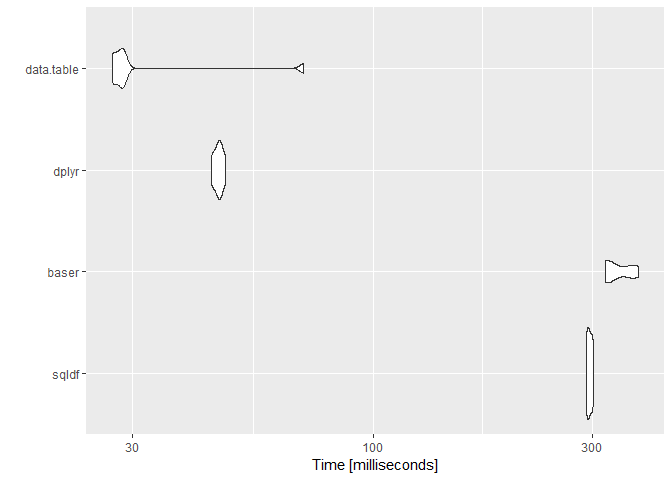
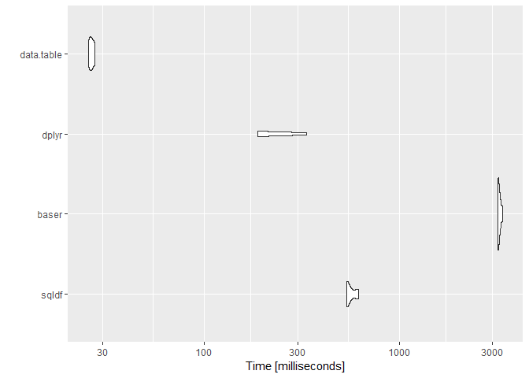
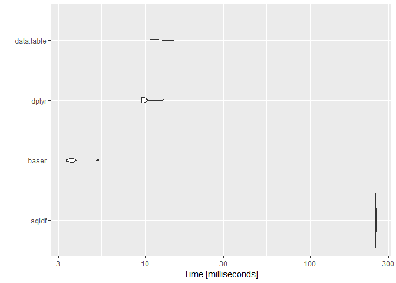
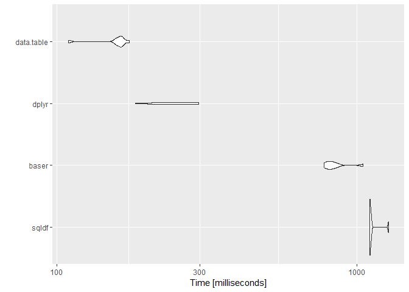

Testy
-----

Funkcja `same` sprawdza równość podanych argumentów, zakładając, że
`NA == NA`.  
Funkcja `same_df` porównuje ramki danych przy użyciu funkcji `same`.
`same_df` przyjmuje także argument `uniqueCol` - jest to nazwa takiej
kolumny w podanych ramkach danych, że wartości w tych kolumnach są
unikalne i atomowe.  
Funkcja `test`, korzystając z funkcji `same_df`, sprawdza poprawność
działania podanej funkcji `z` i zwraca `microbenchmark` wywołań funkcji
`z` dla różynych sposobów implementacji zapytań SQL.

    same <- function(x, y)
    {
      x == y | is.na(x) & is.na(y)
    }
    same_df <- function(x, y, uniqueCol)
    {
      all(same(x[order(x[[uniqueCol]]),], y[order(y[[uniqueCol]]),]))
    }

    test <- function(z, uniqCol)
    {
      df1 <- z("sqldf")
      df2 <- z("baser")
      df3 <- z("dplyr")
      df4 <- z("data.table")
      all(df1 == df2)
      all(df1 == df3)
      all(df1 == df4)
      stopifnot(same_df(df1, df2, uniqCol) & same_df(df1, df3, uniqCol) & same_df(df1, df4, uniqCol))
      microbenchmark(
        sqldf = z("sqldf"),
        baser = z("baser"),
        dplyr = z("dplyr"),
        data.table = z("data.table"),
        times = 8
      )
    }

------------------------------------------------------------------------

Zadanie1
--------

Zwraca 10 użytkowników, których pytania zostały w sumie dodane do
ulubionch największą ilość razy.  
Zwraca nazwę, id, lokację użytkownika, sumę dodań do ulubionych dla
wszystkich zadanych przez niego pytań, pytanie tego użytkownika dodane
do ulubionych największą liczbę razy i liczbę dodań do ulubionych dla
tego pytania.

### Kod

    Z1 <- function (x)
    {
      if(x == "sqldf")
      {
        return(
        sqldf("SELECT Users.DisplayName,
               Users.Id,
               Users.Location,
               SUM(Posts.FavoriteCount) AS FavoriteTotal,
               Posts.Title AS MostFavoriteQuestion,
               MAX(Posts.FavoriteCount) AS MostFavoriteQuestionLikes
               FROM Posts
               JOIN Users ON Users.Id=Posts.OwnerUserId
               WHERE Posts.PostTypeId=1
               GROUP BY OwnerUserId
               ORDER BY FavoriteTotal DESC
               LIMIT 10"))
      }
      if(x == "baser")
      {
        q <- subset(Posts, PostTypeId == 1 & !is.na(FavoriteCount))[c("OwnerUserId", "Title", "FavoriteCount")]
        u_q <- merge(Users, q, by.x = "Id", by.y = "OwnerUserId")[c("DisplayName", "Id", "Location", "FavoriteCount", "Title")]
        g <- do.call(data.frame, aggregate(u_q["FavoriteCount"], u_q[c("DisplayName", "Id", "Location")], function(x)
          c(sum = sum(x), max = max(x))))
        g <- head(g[order(-g$FavoriteCount.sum),], 10)
        g <- merge(g, q, by.x = c("Id", "FavoriteCount.max"), by.y = c("OwnerUserId", "FavoriteCount"))
        g <- g[,c(3,1,4,5,6,2)]
        colnames(g) <- c("DisplayName", "Id", "Location", "FavoriteTotal", "MostFavoriteQuestion", "MostFavoriteQuestionLikes")
        return(g[order(-g$FavoriteTotal),])
      }
      if(x == "dplyr")
      {
        q_by_u <- 
          filter(Posts, PostTypeId == 1, !is.na(FavoriteCount), !is.na(OwnerUserId))[c("OwnerUserId", "Title", "FavoriteCount")] %>% 
          group_by(OwnerUserId)
        sc <- 
          q_by_u %>% 
          slice(which.max(FavoriteCount))
        d <- 
          q_by_u %>% 
          summarise(FavoriteTotal = sum(FavoriteCount)) %>% 
          arrange(-FavoriteTotal) %>% 
          head(10) %>% 
          inner_join(sc) %>% 
          inner_join(Users[c("DisplayName", "Id", "Location")], by = c("OwnerUserId" = "Id")) %>% 
          select(DisplayName, Id = OwnerUserId, Location, FavoriteTotal, MostFavoriteQuestion = Title, MostFavoriteQuestionLikes = FavoriteCount)
        return(as.data.frame(d))
      }
      if(x == "data.table")
      {
        #setkey(UsersDT, Id) jeśli nie ustawione wcześniej
        q <- PostsDT[PostTypeId == 1 & !is.na(FavoriteCount) & !is.na(OwnerUserId),.(OwnerUserId, Title, FavoriteCount)]
        #sd <- q[,.SD[which.max(FavoriteCount)], keyby = OwnerUserId] #wolne :(
        sd <- q[q[,.I[which.max(FavoriteCount)], keyby = OwnerUserId]$V1] #szybkie :)
        fv <- 
          q[,.(FavoriteTotal = sum(FavoriteCount)), by = OwnerUserId
            ][order(-FavoriteTotal)
              ][1:10]
        setkey(fv, OwnerUserId)
        d <- 
          fv[sd, nomatch = 0
             ][UsersDT[,.(DisplayName, Id, Location)], nomatch = 0
               ][order(-FavoriteTotal)
                 ][,.(DisplayName, Id = OwnerUserId, Location, FavoriteTotal, MostFavoriteQuestion = Title, MostfavoriteQuestionLikes = FavoriteCount)]
        return(as.data.frame(d))
      }
      stop("Wrong argument. Has to be one of ('sqldf' 'baser' 'dplyr' 'data.table')")
    }

### Benchmark

    ## Unit: milliseconds
    ##        expr       min        lq      mean    median        uq      max
    ##       sqldf 318.28182 320.83726 336.51604 330.53678 349.24589 372.6067
    ##       baser 105.86869 106.48697 109.78338 107.55767 111.49171 121.3257
    ##       dplyr  61.56932  64.92018  82.00078  67.24304 102.65639 124.7977
    ##  data.table  17.06427  18.01222  18.81576  18.43118  19.10919  22.3566
    ##  neval  cld
    ##      8    d
    ##      8   c 
    ##      8  b  
    ##      8 a

------------------------------------------------------------------------

Zadanie2
--------

Zwraca 10 pytań (id, tytuł, *pac*) z największą liczbą(oznaczoną jako
*pac*) odpowiedzi o dodatnim wyniku na dane pytanie.

### Kod

    Z2 <- function (x)
    {
      if(x == "sqldf")
      {
        return(
          sqldf("SELECT Posts.ID,
                Posts.Title,
                Posts2.PositiveAnswerCount
                FROM Posts
                JOIN (
                SELECT
                Posts.ParentID,
                COUNT(*) AS PositiveAnswerCount
                FROM Posts
                WHERE Posts.PostTypeID=2 AND Posts.Score>0
                GROUP BY Posts.ParentID
                ) AS Posts2
                ON Posts.ID=Posts2.ParentID
                ORDER BY Posts2.PositiveAnswerCount DESC
                LIMIT 10"))
      }
      if(x == "baser")
      {
        p <- subset(Posts, PostTypeId == 2 & Score > 0)
        p <- aggregate(p$ParentId, p["ParentId"], length)
        colnames(p) <- c("ParentId", "PositiveAnswerCount")
        p <- merge(Posts, p, by.x = "Id", by.y = "ParentId")[c("Id", "Title", "PositiveAnswerCount")]
        return(head(p[order(-p$PositiveAnswerCount),], 10))
      }
      if(x == "dplyr")
      {
        d <- 
          filter(Posts, PostTypeId == 2, Score > 0) %>%
          group_by(ParentId) %>%
          summarise(PositiveAnswerCount = n()) %>%
          inner_join(Posts, by = c("ParentId" = "Id")) %>%
          arrange(-PositiveAnswerCount) %>%
          select(Id = ParentId, Title, PositiveAnswerCount) %>%
          head(10)
        return(as.data.frame(d))
      }
      if(x == "data.table")
      {
        #setkey(PostsDT, Id) jeśli nie ustawione wczesniej
        d <-
          PostsDT[PostTypeId == 2 & Score > 0
                  ][,.(PositiveAnswerCount = .N), keyby = ParentId
                    ][PostsDT, nomatch = 0
                      ][order(-PositiveAnswerCount)
                        ][1:10,.(Id = ParentId, Title, PositiveAnswerCount)]
        return(as.data.frame(d))
      }
      stop("Wrong argument. Has to be one of ('sqldf' 'baser' 'dplyr' 'data.table')")
    }

### Benchmark

    ## Unit: milliseconds
    ##        expr       min        lq      mean    median        uq       max
    ##       sqldf 219.49338 221.04544 227.63401 222.16972 235.08955 244.96929
    ##       baser 318.52610 324.73825 348.61253 355.64854 365.45890 378.68274
    ##       dplyr  49.78999  50.43577  57.55759  50.66588  58.15400  92.15939
    ##  data.table  23.27170  23.57017  29.19544  24.82171  25.88502  61.73806
    ##  neval  cld
    ##      8   c 
    ##      8    d
    ##      8  b  
    ##      8 a

------------------------------------------------------------------------

Zadanie3
--------

Dla każdego roku zwraca tytuł pytania, które dostało najwięcej upvotów w
danym roku, ten rok i tą liczbę upVotów.

### Kod

    Z3 <- function (x)
    {
      if(x == "sqldf")
      {
        return(
          sqldf("SELECT Posts.Title,
                UpVotesPerYear.Year,
                MAX(UpVotesPerYear.Count) AS Count
                FROM (
                SELECT
                PostId,
                COUNT(*) AS Count,
                STRFTIME('%Y', Votes.CreationDate) AS Year
                FROM Votes
                WHERE VoteTypeId=2
                GROUP BY PostId, Year
                ) AS UpVotesPerYear
                JOIN Posts ON Posts.Id=UpVotesPerYear.PostId
                WHERE Posts.PostTypeId=1
                GROUP BY Year"))
      }
      if(x == "baser")
      {
        uv <- subset(Votes, VoteTypeId == 2)[c("PostId", "CreationDate")]
        #uv["CreationDate"] <- format(as.Date(unlist(uv["CreationDate"])), "%Y")  #na górze bardzo wolny sposób,
        uv["CreationDate"] <- strtoi(substr(unlist(uv["CreationDate"]), 1, 4))    #na dole substr, szybszy niż as.Date,
                                                                                  #funkcje z base i tak są najwolniejsze,
        uv_y <- aggregate(cbind(PostId)~PostId+CreationDate, uv, length)          #strtoi trochę przyśpiesza aggregate.
        colnames(uv_y) <- c("Id", "Year", "Count")
        q <- subset(Posts, PostTypeId == 1)[c("Id", "Title")]
        q_uv_y <- subset(merge(q, uv_y, by = "Id"), select = -Id)
        g <- aggregate(Count ~ Year, data = q_uv_y, max)
        g <- merge(g, q_uv_y, by = c("Year", "Count"))
        return(g[,c(3,1,2)])
      }
      if(x == "dplyr")
      {
        q <-
          filter(Posts, PostTypeId == 1)[c("Id", "Title")]
        q_uv_y <- 
          filter(Votes, VoteTypeId == 2) %>%
          select(Id = PostId, CreationDate) %>%
          mutate(Year = replace(CreationDate, TRUE, substr(unlist(CreationDate), 1, 4))) %>%
          group_by(Id, Year) %>%
          summarise(Count = n()) %>%
          inner_join(q)
        d <-
          q_uv_y %>%
          group_by(Year) %>%
          summarise(Count = max(Count)) %>% 
          inner_join(q_uv_y) %>%
          select(Title, Year, Count)
        return(as.data.frame(d))
      }
      if(x == "data.table")
      {
        q_uv_y <- 
          VotesDT[VoteTypeId == 2,.(Id = PostId, Year = substr(unlist(CreationDate), 1, 4))
                  ][,.(Count = .N), by =.(Id, Year)
                    ][PostsDT[PostTypeId == 1,.(Id, Title)], on =.(Id = Id), nomatch = 0]
        d <- 
          q_uv_y[,.(Count = max(Count)), by = Year
                 ][q_uv_y,.(Title, Year, Count), on =.(Count = Count, Year = Year), nomatch = 0]
        return(as.data.frame(d))
      }
      stop("Wrong argument. Has to be one of ('sqldf' 'baser' 'dplyr' 'data.table')")
    }

### Benchmark

    ## Unit: milliseconds
    ##        expr        min         lq      mean    median        uq       max
    ##       sqldf 1140.08632 1145.27396 1154.2397 1152.4172 1158.1423 1182.1646
    ##       baser 3011.87294 3042.78549 3127.3802 3130.4972 3215.2582 3230.0867
    ##       dplyr  310.01880  312.94619  345.6452  360.2093  365.4012  378.0296
    ##  data.table   87.65859   89.20388  117.6874  116.9251  145.1143  151.3545
    ##  neval  cld
    ##      8   c 
    ##      8    d
    ##      8  b  
    ##      8 a

------------------------------------------------------------------------

Zadanie4
--------

Zwraca pytania z największą różnicą pomiędzy wynikiem najwyżej
punktowanej i zaakceptowanej odpowiedzi, posortowane malejąco względem
tej różnicy.

### Kod

    Z4 <- function (x)
    {
      if(x == "sqldf")
      {
        return(
          sqldf("SELECT Questions.Id,
                Questions.Title,
                BestAnswers.MaxScore,
                Posts.Score AS AcceptedScore,
                BestAnswers.MaxScore-Posts.Score AS Difference
                FROM (
                SELECT Id, ParentId, MAX(Score) AS MaxScore
                FROM Posts
                WHERE PostTypeId==2
                GROUP BY ParentId
                ) AS BestAnswers
                JOIN (
                SELECT * FROM Posts
                WHERE PostTypeId==1
                ) AS Questions
                ON Questions.Id=BestAnswers.ParentId
                JOIN Posts ON Questions.AcceptedAnswerId=Posts.Id
                WHERE Difference>50
                ORDER BY Difference DESC"))
      }
      if(x == "baser")
      {
        q <- subset(Posts, PostTypeId == 1 & !is.na(AcceptedAnswerId))[c("Id", "Title", "AcceptedAnswerId")]
        a <- subset(Posts, PostTypeId == 2)[c("Id", "ParentId", "Score")]
        ba <- aggregate(Score ~ ParentId, data = a, max)
        q_ba <- merge(q, ba, by.x = "Id", by.y = "ParentId")
        aa <- a[c("Id", "Score")]
        colnames(aa) <- c("Id", "AcceptedScore")
        q_ba_aa <- merge(q_ba, aa, by.x = "AcceptedAnswerId", by.y = "Id")
        q_d = cbind(q_ba_aa, q_ba_aa["Score"] - q_ba_aa["AcceptedScore"])
        colnames(q_d) <- c("aaid", "Id", "Title", "MaxScore", "AcceptedScore", "Difference")
        q_d <- subset(q_d, Difference > 50, select = -aaid)
        return(q_d[order(-q_d$Difference),])
      }
      if(x == "dplyr")
      {
        q <- filter(Posts, PostTypeId == 1, !is.na(AcceptedAnswerId))[c("Id", "Title", "AcceptedAnswerId")]
        a <- filter(Posts, PostTypeId == 2)[c("Id", "ParentId", "Score")]
        aa <- select(a, Id, AcceptedScore = Score)
        d <- 
          group_by(a, ParentId) %>% 
          summarise(MaxScore = max(Score)) %>%
          inner_join(q, by = c("ParentId" = "Id")) %>%
          inner_join(aa, by = c("AcceptedAnswerId" = "Id")) %>%
          mutate(Difference = MaxScore - AcceptedScore) %>%
          filter(Difference > 50) %>%
          select(Id = ParentId, Title, MaxScore, AcceptedScore, Difference) %>%
          arrange(-Difference)
        return(as.data.frame(d))
      }
      if(x == "data.table")
      {
        a <- PostsDT[PostTypeId == 2,.(Id, ParentId, Score)]
        d <- 
          a[,.(MaxScore = max(Score)), keyby = ParentId
            ][PostsDT[PostTypeId == 1 & !is.na(AcceptedAnswerId),.(Id, Title, AcceptedAnswerId)], nomatch = 0
              ][a[,.(Id, AcceptedScore = Score)], on =.(AcceptedAnswerId = Id), nomatch = 0
                ][,.(Id = ParentId, Title, MaxScore, AcceptedScore, Difference = MaxScore - AcceptedScore)
                  ][Difference > 50
                    ][order(-Difference)]
        return(as.data.frame(d))
      }
      stop("Wrong argument. Has to be one of ('sqldf' 'baser' 'dplyr' 'data.table')")
    }

### Benchmark

    ## Unit: milliseconds
    ##        expr       min        lq      mean    median        uq       max
    ##       sqldf 291.04344 292.09095 295.64164 295.34718 299.16380 300.88583
    ##       baser 320.15473 321.13182 340.17800 325.87648 364.91390 377.42483
    ##       dplyr  44.44265  45.29945  46.08975  46.17063  46.80985  47.71551
    ##  data.table  27.12055  27.30058  33.31372  28.44517  28.63033  70.63701
    ##  neval cld
    ##      8  b 
    ##      8   c
    ##      8 a  
    ##      8 a

------------------------------------------------------------------------

Zadanie5
--------

Zwraca 10 pytań (tytuł pytania, *wynik komentarzy autora*) z największym
*wynikiem komentarzy autora*, gdzie *wynik komentarzy autora* to suma
punktów uzyskanych przez autora pytania w komentarzach do tego pytania.

### Kod

    Z5 <- function (x)
    {
      if(x == "sqldf")
      {
        return(
          sqldf("SELECT Posts.Title,
                CmtTotScr.CommentsTotalScore
                FROM (
                SELECT
                PostID,
                UserID,
                SUM(Score) AS CommentsTotalScore
                FROM Comments
                GROUP BY PostID, UserID
                ) AS CmtTotScr
                JOIN Posts ON Posts.ID=CmtTotScr.PostID AND Posts.OwnerUserId=CmtTotScr.UserID
                WHERE Posts.PostTypeId=1
                ORDER BY CmtTotScr.CommentsTotalScore DESC
                LIMIT 10"))
      }
      if(x == "baser")
      {
        c <- Comments[c("PostId", "UserId", "Score")]
        c <- aggregate(Score ~ PostId + UserId, data = c, sum)
        colnames(c) <- c("pid", "uid", "CommentsTotalScore")
        q <- subset(Posts, PostTypeId == 1)[c("Id", "Title", "OwnerUserId")]
        q_cts <- merge(q, c, by.x = c("Id", "OwnerUserId"), by.y = c("pid", "uid"))[,c(3,4)]
        return(head(q_cts[order(-q_cts$CommentsTotalScore),], 10))
      }
      if(x == "dplyr")
      {
        cts <-
          select(Comments, PostId, UserId, Score) %>%
          group_by(PostId, UserId) %>%
          summarise(CommentsTotalScore = sum(Score))
        d <- 
          filter(Posts, PostTypeId == 1)[c("Id", "Title", "OwnerUserId")] %>% 
          inner_join(cts, by = c("Id" = "PostId", "OwnerUserId" = "UserId")) %>%
          select(Title, CommentsTotalScore) %>%
          arrange(-CommentsTotalScore) %>%
          head(10)
        return(as.data.frame(d))
      }
      if(x == "data.table")
      {
        setkeyv(PostsDT, c("Id", "OwnerUserId"))
        d <-
          CommentsDT[,.(CommentsTotalScore = sum(Score)), keyby =.(PostId, UserId)
                     ][PostsDT[PostTypeId == 1,.(Id, Title, OwnerUserId)], nomatch = 0
                       ][order(-CommentsTotalScore),.(Title, CommentsTotalScore)
                         ][1:10]
        return(as.data.frame(d))
      }
      stop("Wrong argument. Has to be one of ('sqldf' 'baser' 'dplyr' 'data.table')")
    }

### Benchmark

    ## Unit: milliseconds
    ##        expr        min         lq       mean     median         uq
    ##       sqldf  533.78307  537.73702  559.72069  541.58649  585.58308
    ##       baser 3195.24048 3198.05230 3244.53232 3219.06395 3277.97910
    ##       dplyr  187.28783  191.39306  233.79705  220.86357  262.63871
    ##  data.table   25.53421   25.77992   26.43551   26.36413   27.05877
    ##         max neval  cld
    ##   614.16928     8   c 
    ##  3370.82738     8    d
    ##   333.29789     8  b  
    ##    27.54424     8 a

------------------------------------------------------------------------

Zadanie6
--------

Zwraca użytkowników (id, nazwę, reputację, wiek, lokację), którzy są w
posiadaniu *wartościowej* odznaki.  
Odznaka jest *wartościowa* wtedy i tylko wtedy gdy jest złota i została
zdobyta przez od 2 do 10 użytkowników.

### Kod

    Z6 <- function (x)
    {
      if(x == "sqldf")
      {
        return(
          sqldf("SELECT DISTINCT Users.Id,
                Users.DisplayName,
                Users.Reputation,
                Users.Age,
                Users.Location
                FROM (
                SELECT
                Name, UserID
                FROM Badges
                WHERE Name IN (
                SELECT
                Name
                FROM Badges
                WHERE Class=1
                GROUP BY Name
                HAVING COUNT(*) BETWEEN 2 AND 10
                )
                AND Class=1
                ) AS ValuableBadges
                JOIN Users ON ValuableBadges.UserId=Users.Id"))
      }
      if(x == "baser")
      {
        b <- subset(Badges, Class == 1, select = c("Name", "UserId"))
        vbNames <- subset(aggregate(b$Name, b["Name"], length), x <= 10 & x >= 2, select = "Name")
        vbUid <- subset(b, Name %in% unlist(vbNames), select = "UserId")
        return(subset(Users, Id %in% unlist(vbUid), select = c("Id", "DisplayName", "Reputation", "Age", "Location")))
      }
      if(x == "dplyr")
      {
        b <- 
          filter(Badges, Class == 1) %>%
          select(Name, UserId)
        vbNames <-
          group_by(b, Name) %>%
          summarise(Count = n()) %>%
          filter(dplyr::between(Count, 2, 10)) %>%
          select(Name)
        vbUid <- 
          filter(b, Name %in% unlist(vbNames)) %>%
          select(UserId)
        d <-
          filter(Users, Id %in% unlist(vbUid)) %>%
          select(Id, DisplayName, Reputation, Age, Location)
        return(as.data.frame(d))
      }
      if(x == "data.table")
      {
        b <- BadgesDT[Class == 1,.(Name, UserId)]
        vbNames <- b[,.(Count = .N), by = Name][data.table::between(Count, 2, 10), Name]
        vbUid <- b[Name %in% unlist(vbNames), UserId]
        d <- UsersDT[Id %in% unlist(vbUid),.(Id, DisplayName, Reputation, Age, Location)]
        return(as.data.frame(d))
      }
      stop("Wrong argument. Has to be one of ('sqldf' 'baser' 'dplyr' 'data.table')")
    }

### Benchmark

    ## Unit: milliseconds
    ##        expr        min         lq       mean     median         uq
    ##       sqldf 248.807472 249.153766 249.864880 249.717239 250.383962
    ##       baser   3.345936   3.505021   3.771311   3.603963   3.687304
    ##       dplyr   9.546796   9.663186  10.234356   9.840747  10.141881
    ##  data.table  10.719311  10.898308  12.121525  11.814849  12.949182
    ##         max neval  cld
    ##  251.601636     8    d
    ##    5.231976     8 a   
    ##   13.036423     8  b  
    ##   14.928210     8   c

------------------------------------------------------------------------

Zadanie7
--------

Zwraca 10 pytań (tytuł i liczbę *starych* upvotów) z największą liczbą
*starych* upvotów i bez *nowych* upvotów. Upvote jest *nowy* jeśli był
dodany w 2016 lub 2017 roku. Upvoty które nie są *nowe*, są *stare*.

### Kod

    Z7 <- function (x)
    {
      if(x == "sqldf")
      {
        return(
          sqldf("SELECT Posts.Title,
           VotesByAge2.OldVotes
                FROM Posts JOIN (
                SELECT
                PostId,
                MAX(CASE WHEN VoteDate = 'new' THEN Total ELSE 0 END) NewVotes,
                MAX(CASE WHEN VoteDate = 'old' THEN Total ELSE 0 END) OldVotes,
                SUM(Total) AS Votes
                FROM (
                SELECT
                PostId,
                CASE STRFTIME('%Y', CreationDate)
                WHEN '2017'
                THEN 'new'
                WHEN '2016'
                THEN 'new'
                ELSE 'old'
                END VoteDate,
                COUNT(*) AS Total
                FROM Votes
                WHERE VoteTypeId=2
                GROUP BY PostId, VoteDate
                ) AS VotesByAge
                GROUP BY VotesByAge.PostId
                HAVING NewVotes=0
                ) AS VotesByAge2 ON VotesByAge2.PostId=Posts.ID
                WHERE Posts.PostTypeId=1
                ORDER BY VotesByAge2.OldVotes DESC
                LIMIT 10"))
      }
      if(x == "baser")
      {
        v <- subset(Votes, VoteTypeId == 2, select = c("PostId", "CreationDate"))
        v["CreationDate"] <- substr(unlist(v["CreationDate"]), 1, 4)
        isNew <- v$CreationDate == 2017 | v$CreationDate == 2016
        nvId <- unique(v[isNew, "PostId"])
        ov <- subset(v[!isNew,], !PostId%in%nvId)
        q <- subset(Posts, PostTypeId == 1 & !Id%in%nvId)[c("Id", "Title")]
        g <- aggregate(ov$PostId, ov["PostId"], length)
        q_ov <- merge(q, g, by.x = "Id", by.y = "PostId")
        q_ov <- q_ov[,c(2,3)]
        colnames(q_ov) <- c("Title", "OldVotes") 
        return(head(q_ov[order(-q_ov$OldVotes),], 10))
      }
      if(x == "dplyr")
      {
        v <- 
          filter(Votes, VoteTypeId == 2) %>% 
          select(PostId, CreationDate) %>%
          mutate(CreationDate = replace(CreationDate, TRUE, substr(unlist(CreationDate), 1, 4)))
        isNew <- v$CreationDate == 2017 | v$CreationDate == 2016
        nvId <- unique(v[isNew, "PostId"])
        q <- 
          filter(Posts, PostTypeId == 1, !Id%in%nvId) %>% 
          select(Id, Title)
        d <- 
          filter(v[!isNew,], !PostId%in%nvId) %>% 
          group_by(PostId) %>% 
          summarise(OldVotes = n()) %>% 
          inner_join(q, by = c("PostId" = "Id")) %>% 
          arrange(-OldVotes) %>% 
          head(10) %>%
          select(Title, OldVotes)
        return(as.data.frame(d))
      }
      if(x == "data.table")
      {
        v <- VotesDT[VoteTypeId == 2,.(PostId, Year = substr(unlist(CreationDate), 1, 4))]
        isNew <- v$Year == 2017 | v$Year == 2016
        nvId <- unlist(unique(v[isNew, "PostId"]))
        nv <- v[isNew, "PostId"][,.N, keyby = PostId]
        setkey(PostsDT,Id) #jeśli nie ustawione wcześniej (zmienione w Z5)
        ov <- v[!isNew, "PostId"][,.(OldVotes = .N), keyby = PostId]
        d <- 
          nv[PostsDT[PostTypeId == 1,.(Id, Title)]
             ][is.na(N)
               ][ov, nomatch = 0
                 ][order(-OldVotes),.(Title, OldVotes)
                   ][1:10]
        #Joining is faster(whole method nearly twice as fast), %in% operator is slow, %in% could be better, a hashset would be nice :/
        #q <- PostsDT[PostTypeId == 1 & !Id%in%nvId,.(Id, Title)]
        #setkey(q, Id)
        #d <-
        #  v[!isNew & !PostId%in%nvId,.(OldVotes = .N), keyby = PostId
        #    ][q, nomatch = 0
        #      ][order(-OldVotes),.(Title, OldVotes)
        #        ][1:10]
        return(as.data.frame(d))
      }
      stop("Wrong argument. Has to be one of ('sqldf' 'baser' 'dplyr' 'data.table')")
    }

### Benchmark

    ## Unit: milliseconds
    ##        expr       min        lq      mean    median        uq       max
    ##       sqldf 1101.7817 1102.5441 1127.4662 1105.2578 1114.6022 1273.1400
    ##       baser  777.0523  798.7175  845.3686  818.3048  852.3223 1047.2073
    ##       dplyr  182.7176  206.9884  240.8352  235.8924  280.9865  296.2290
    ##  data.table  109.3563  157.6894  156.8653  162.9099  164.9355  174.4965
    ##  neval  cld
    ##      8    d
    ##      8   c 
    ##      8  b  
    ##      8 a

------------------------------------------------------------------------

Podsumowanie
------------
